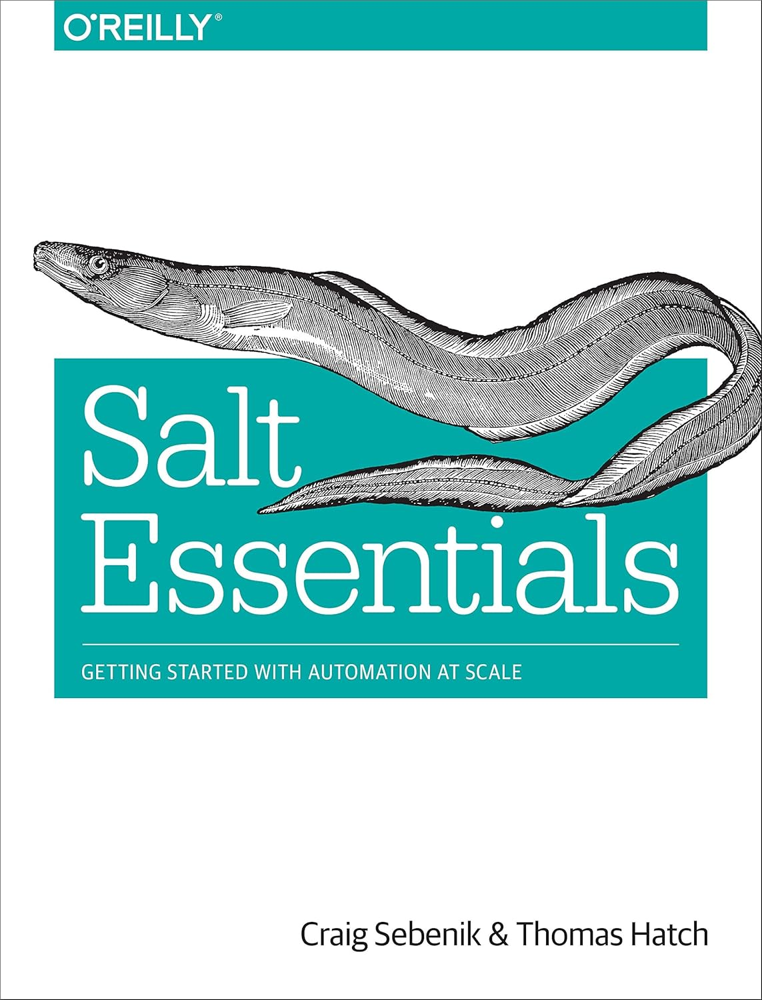

# Salt Essentials Notes

## Overview
Reading notes from the book "Salt Essentials" by Craig Sebenik and Thomas Hatch.  

### Note
I highly recommend configuring your vim instance to use vimwiki before reading these notes  

I use this Vim plugin manager:
[vim-plug](https://github.com/junegunn/vim-plug)

Here is the guide for installing vimwiki:
[vimwiki](https://github.com/vimwiki/vimwiki#installation)

For an example, here's my vimrc:
[My Vimrc](https://github.com/ngrogg/dotfiles/blob/main/.vimrc)

## Book information
Name: Salt Essentials  
Author: Craig Sebenik, Thomas Hatch  
Publisher: O'reilly Media  
ISBN: 978-1491900635  
Cover:  

